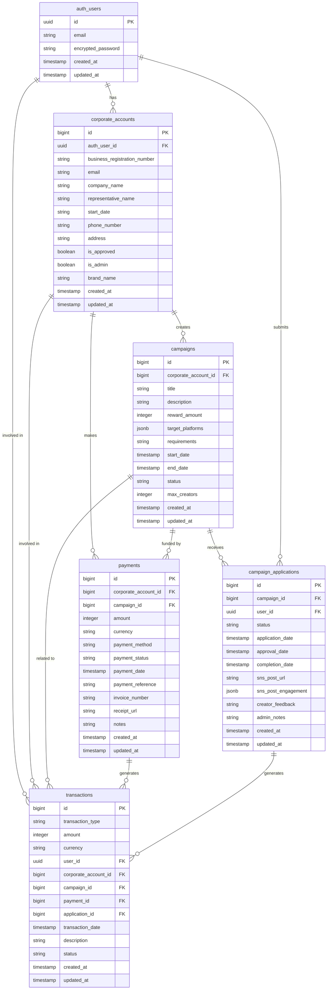

# CNEC 데이터베이스 스키마 다이어그램

## 테이블 설명

### auth.users
Supabase 인증 시스템에서 관리하는 사용자 계정 정보입니다. 모든 사용자(관리자, 기업, 크리에이터)의 기본 인증 정보를 저장합니다.

### corporate_accounts
기업 계정 정보를 저장합니다. 관리자 계정도 이 테이블에 `is_admin=true`로 저장됩니다.
- `auth_user_id`: auth.users 테이블과의 연결 키
- `business_registration_number`: 사업자등록번호 (더 이상 unique 제약 없음)
- `email`: 로그인에 사용되는 이메일 (unique)
- `brand_name`: 다중 브랜드 지원을 위한 브랜드명

### campaigns
기업이 생성한 캠페인 정보를 저장합니다.
- `corporate_account_id`: 캠페인을 생성한 기업 계정 ID
- `status`: 캠페인 상태 (draft, active, completed, cancelled)
- `target_platforms`: 대상 SNS 플랫폼 정보 (JSON 형식)

### campaign_applications
크리에이터의 캠페인 신청 정보를 저장합니다.
- `campaign_id`: 신청한 캠페인 ID
- `user_id`: 신청한 크리에이터의 사용자 ID
- `status`: 신청 상태 (pending, approved, rejected, completed)
- `sns_post_engagement`: SNS 게시물의 참여 지표 (좋아요, 댓글, 공유 등)

### payments
기업의 캠페인 비용 결제 정보를 저장합니다.
- `corporate_account_id`: 결제한 기업 계정 ID
- `campaign_id`: 결제와 관련된 캠페인 ID
- `payment_status`: 결제 상태 (pending, completed, failed, refunded)

### transactions
시스템 내 모든 금전적 거래 내역을 기록합니다.
- `transaction_type`: 거래 유형 (payment_in, creator_payment_out, refund 등)
- `user_id`: 거래와 관련된 사용자 ID (크리에이터)
- `corporate_account_id`: 거래와 관련된 기업 계정 ID
- `campaign_id`: 거래와 관련된 캠페인 ID
- `payment_id`: 거래와 관련된 결제 ID
- `application_id`: 거래와 관련된 캠페인 신청 ID
