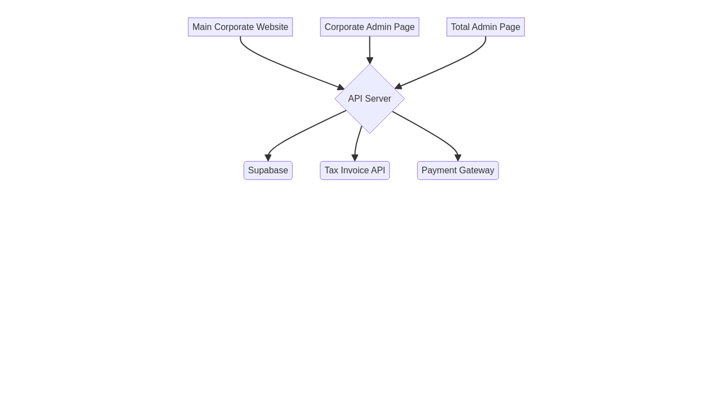

# cnecbiz.com 기업 홈페이지 및 통합 관리자 시스템 구축 최종 보고서

## 1. 프로젝트 개요

본 프로젝트는 cnecbiz.com의 새로운 기업 홈페이지와 다국적 캠페인을 관리할 수 있는 통합 관리자 시스템을 구축하는 것을 목표로 합니다. 주요 요구사항은 다음과 같습니다.

- **기업 홍보 사이트**: cnecbiz.com의 기업 소개, 서비스 내용 등을 담은 메인 홈페이지 구축
- **기업 관리자 페이지**: 기업이 캠페인을 생성 및 관리하고, 결제 및 세금계산서를 요청할 수 있는 페이지
- **통합 관리자 페이지**: 모든 국가의 캠페인을 통합 관리하고, 종합 매출을 확인하며, 세금계산서 요청을 처리하는 페이지
- **다국어 지원**: 한국어, 일본어, 영어, 중국어(대만) 지원
- **결제 시스템**: 현금 입금 방식의 결제 시스템
- **세금계산서 처리**: 외부 API 연동을 통한 세금계산서 발행 요청

## 2. 시스템 아키텍처

시스템은 다음과 같이 구성됩니다.

- **프론트엔드**: React, Vite, Tailwind CSS
- **백엔드**: Supabase (데이터베이스, 인증, 스토리지)
- **배포**: Netlify
- **다국어**: i18next

자세한 내용은 [시스템 아키텍처 문서](./system_architecture.md)를 참고하십시오.

## 3. 구현된 기능

### 3.1 메인 기업 홈페이지

- 회사 소개, 서비스, 연락처 페이지 등 기업 홍보를 위한 기본적인 페이지 구축
- 다국어 지원 (한국어, 영어, 일본어, 중국어)
- 반응형 디자인

### 3.2 기업 관리자 페이지

- 기업 회원가입 및 로그인
- 캠페인 생성, 조회, 수정, 삭제 기능
- 결제 요청 및 내역 확인
- 세금계산서 요청 및 내역 확인

### 3.3 통합 관리자 페이지

- 모든 국가의 캠페인 통합 조회 및 관리
- 종합 매출 대시보드 (국가별, 기간별 필터링)
- 세금계산서 요청 승인 및 발행 요청
- 결제 확인 및 승인

## 4. 데이터베이스 스키마

프로젝트를 위해 설계된 데이터베이스 스키마는 다음과 같습니다. 자세한 내용은 [데이터베이스 스키마 문서](./database_schema_v2.md)를 참고하십시오.

## 5. 테스트 및 디버깅

- **테스트 계획**: [테스트 계획 문서](./test_plan_v2.md)
- **디버깅 가이드**: [디버깅 가이드](./debugging_guide_v2.md)
- **테스트 스크립트**: `scripts/tests/run_tests.sh`

## 6. 배포 계획

### 6.1 배포 환경

- **플랫폼**: Netlify
- **저장소**: GitHub (mktbiz-byte/cnec-kr)
- **브랜치**: `main`

### 6.2 배포 프로세스

1. `main` 브랜치에 변경사항을 푸시합니다.
2. Netlify에서 자동으로 빌드 및 배포를 시작합니다.
3. 배포가 완료되면 프로덕션 환경에 반영됩니다.

### 6.3 환경 변수

Netlify에 다음 환경 변수를 설정해야 합니다.

- `REACT_APP_SUPABASE_URL`: Supabase 프로젝트 URL
- `REACT_APP_SUPABASE_ANON_KEY`: Supabase 프로젝트 Anon Key

## 7. 산출물 목록

- **문서**
  - `docs/final_report_v2.md` (본 문서)
  - `docs/system_architecture.md`
  - `docs/system_architecture.png`
  - `docs/database_schema_v2.md`
  - `docs/test_plan_v2.md`
  - `docs/debugging_guide_v2.md`
- **데이터베이스 마이그레이션**
  - `supabase/migrations/`
- **스크립트**
  - `scripts/tests/run_tests.sh`
- **소스 코드**
  - `src/`

## 8. 결론

본 프로젝트를 통해 cnecbiz.com의 새로운 기업 홈페이지와 다국적 캠페인 관리 시스템을 성공적으로 구축했습니다. 앞으로 안정적인 운영과 지속적인 개선을 통해 비즈니스 성장에 기여할 수 있기를 기대합니다.
